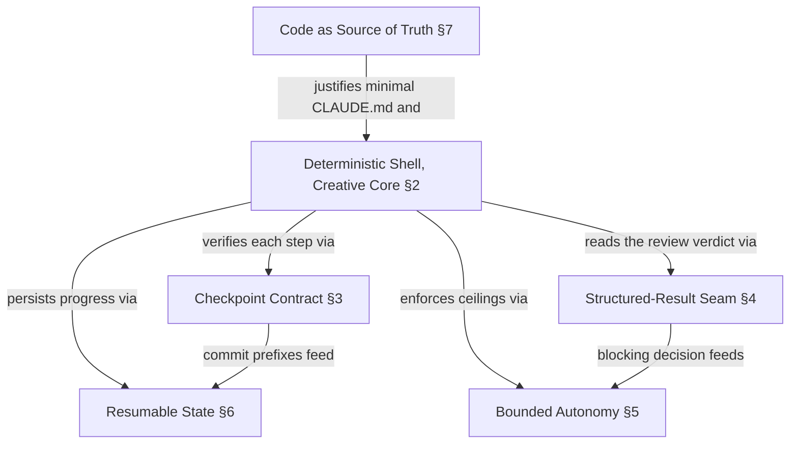

# Concepts

<!-- @tier: 0 -->
<!-- @see-also: ARCHITECTURE.md, README.md -->

This document explains *why* Themis is built the way it is. For *what* the
components are, see [ARCHITECTURE.md](ARCHITECTURE.md); for *how* to run it, see
[README.md](README.md). Vocabulary used here is defined canonically in
[UBIQUITOUS_LANGUAGE.md](UBIQUITOUS_LANGUAGE.md).

## Table of Contents

1. [Problem Statement](#1-problem-statement)
2. [Deterministic Shell, Creative Core](#2-deterministic-shell-creative-core)
3. [The Checkpoint Contract](#3-the-checkpoint-contract)
4. [The Structured-Result Seam](#4-the-structured-result-seam)
5. [Bounded Autonomy](#5-bounded-autonomy)
6. [Resumable State](#6-resumable-state)
7. [Code as the Source of Truth](#7-code-as-the-source-of-truth)
8. [Design Decisions and Roads Not Taken](#8-design-decisions-and-roads-not-taken)
9. [Relationships Between Concepts](#9-relationships-between-concepts)

---

## 1. Problem Statement

An LLM agent given an issue and told "implement this, review it, and open a PR"
will do *something* every time — but not the *same* thing, and not reliably the
*right* thing. Left to drive its own control flow, the agent decides when it is
done, how many times to retry, whether a review finding is blocking, and when to
give up. Those decisions are exactly the ones you cannot afford to leave fuzzy
when the agent is running unattended in a container with
`--dangerously-skip-permissions`.

The naive approach — encode the whole pipeline as instructions in a prompt — has
three failure modes:

- **Non-determinism where it matters.** "Run the review up to twice" becomes
  "run it as many times as the model feels like." Limits stated in prose are
  suggestions, not guarantees.
- **No verifiable progress.** Nothing outside the agent's own narration confirms
  that a step actually produced the work it claims. The agent can report success
  on a step it skipped.
- **Cost with no ceiling.** A loop that the model controls is a loop the model
  can run forever, and every iteration costs tokens.

Themis's answer is to split the work along a single seam: **a compiled Go binary
owns every decision that must be deterministic; the LLM owns only the creative
work inside each step.** The remaining concepts are consequences of taking that
split seriously.

---

## 2. Deterministic Shell, Creative Core

**Definition.** Pipeline control — the sequence of steps, the transition logic,
the cycle limits, the persistence of progress — lives in compiled Go
(`internal/pipeline`, `internal/runner`). The creative work of each step —
writing tests, implementing, reviewing, composing a PR body — is delegated to
Claude Code through a single interface, `agent.Invoker`.

**Motivation.** Anything encoded in Go can be unit-tested, runs at zero token
cost, and behaves identically on every run. Anything encoded in a prompt is
probabilistic. So the dividing line is drawn by asking, for each decision: *does
this need to be the same every time?* Step ordering, "is this a blocking
finding," "have we retried too many times" — yes. "What should this test
assert," "is this code well-structured" — no. The former go in the shell, the
latter in the core.

**Implementation sketch.** The ten-step sequence
(`Fetch → Scan → Branch → TestRed → Implement → Refactor → Review → Fix → Docs → Ship`)
is a Go state machine. `PipelineState.Advance(StepResult)` is the *single*
transition entry point — there is exactly one place where "what happens next" is
decided, and it is pure code with no I/O (`internal/pipeline/pipeline.go`).
Infrastructure steps (Fetch/Scan/Branch) run inline in the runner with no agent.
Creative steps (TestRed through Docs, plus Ship's PR-body composition) render a
per-step markdown template and hand it to `Invoker.Invoke`. The `Invoker`
interface is the seam itself: the runner depends only on the interface, so tests
substitute a `fakeInvoker` and never spawn a real `claude` process.

**What is novel.** The novelty is not "use an LLM to write code" — it is
*refusing* to let the LLM make the control-flow decisions, and making that
refusal structural rather than instructional. The seam is an interface boundary,
not a paragraph in a prompt.

---

## 3. The Checkpoint Contract

**Definition.** After every creative step, the deterministic shell verifies the
repository is in the state that step was supposed to leave it in: a clean working
tree, and — for steps that must produce work — a new commit whose message starts
with the expected conventional-commit prefix.

| Step      | Required prefix | Commit required? |
|-----------|-----------------|------------------|
| TestRed   | `test(`         | yes              |
| Implement | `feat(`         | yes              |
| Refactor  | `refactor(`     | no               |
| Fix       | `fix(`          | yes              |
| Docs      | `docs(`         | no               |

**Motivation.** The agent is *told* to commit its work with a particular prefix.
Telling is not enforcing. The checkpoint is the trust-but-verify half: the prompt
asks, the checkpoint confirms. If a step claims success but left no commit, or
committed with the wrong prefix, or left the tree dirty, the pipeline stops
rather than carrying a phantom result forward. This is what makes "verifiable
progress" (§1) real — progress is measured by commits on disk, not by the agent's
narration.

**Implementation sketch.** `checkpoint.NewStepCheckpoint` snapshots `git HEAD` at
construction, then returns a stateful closure. Each call diffs against the last
snapshot, applies the table above, and *advances the snapshot* so the next step
only sees its own commits (`internal/checkpoint/step_checkpoint.go`). A failed
checkpoint aborts the run with an error naming the step.

**What is novel.** The conventional-commit prefixes are not a style preference
here — they are a machine-readable assertion about *which kind of work* a step
produced. The commit log becomes a verifiable trace of the pipeline's shape
(`test, feat, refactor, fix, docs`), and that shape is later fed back to the Ship
step as `{{PIPELINE_SHAPE}}`.

---

## 4. The Structured-Result Seam

**Definition.** The Review step's verdict crosses the LLM→deterministic boundary
as a structured file, `.themis/review-results.json`, not as parsed prose. The
review agent writes findings (each with a `severity`); the runner reads them and
decides, in code, whether the issue is blocked.

**Motivation.** "Is this finding blocking?" is a deterministic decision (§2) that
depends on fuzzy LLM judgment (the severity assessment). The clean way to compose
the two is to let the LLM emit a *typed* judgment and let the shell apply a
*fixed* rule to it. Severities `critical`, `high`, and `medium` block; `low` does
not (`blockingThreshold = "medium"`). Parsing this out of free-form stdout would
reintroduce non-determinism at exactly the gate we most want to be deterministic.

**The fail-safe.** If `review-results.json` is absent or unparseable after the
Review step, the runner treats the result as **blocking**, not as passing
(`deriveStepResult` in `internal/runner/runner.go`). The dangerous failure is
shipping unreviewed code; the safe failure is stopping. So the *absence* of a
verdict is itself a blocking verdict. To make the default direction explicit, the
Branch step seeds the file with `{"findings":[]}` — review is non-blocking only
if the review agent actively says so.

**What is novel.** The seam inverts the usual "parse what the model said"
pattern. Instead of the deterministic side reverse-engineering intent from prose,
the creative side is required to produce a typed artifact, and missing/malformed
artifacts fail closed.

---

## 5. Bounded Autonomy

**Definition.** Every loop the agent can enter has a deterministic ceiling, and
hitting a ceiling has a defined outcome — never an infinite retry.

- **Test-fix attempts:** capped at 3 *per acceptance-criterion key*. The fourth
  failure on the same AC aborts the run (`pipeline.Advance`, TestRed case).
- **Review cycles:** default ceiling of 2 Review→Fix rounds, raised to 3 only
  when a **Round-3 trigger** is present (a security, public-API, numerical, or
  context-artifact concern justifies one extra round). Cycle 3 is an absolute
  hard stop.
- **Turn budget:** the `run` loop stops launching new issues once
  `THEMIS_TURNS_REMAINING_FRACTION` drops below 0.10, leaving headroom rather
  than running the agent dry mid-issue.

**Motivation.** Unattended autonomy without ceilings is unbounded cost and
unbounded risk. The limits are deliberately small and the *reasons* for the
round-3 escalation are encoded in the trigger taxonomy, not left to the model to
argue for.

**The "ship with unresolved findings" decision.** There is one deliberately
non-obvious branch. If the review-cycle limit is reached *during the current run*
(the agent did real Fix work this session but reviewers still disagree), the
runner does **not** block the issue — it advances to Docs and ships, so a human
decides via the PR. The reasoning: the code works (tests pass), what remains is
*opinion*, and a human reviewing a PR is a better arbiter of unresolved opinion
than an agent looping forever. Only a cycle error inherited from an
already-exhausted resumed state blocks the issue outright
(`runner.Run`, the `state.ReviewCycle > initialReviewCycle` check). Every other
`Advance` error blocks: comment on the issue, add the `blocked` label, stop.

**What is novel.** The system distinguishes *broken* (block, a human must fix)
from *contested* (ship, a human must judge). Most autonomous loops collapse both
into "give up." Here the distinction is a structural branch with a stated
rationale.

---

## 6. Resumable State

**Definition.** Pipeline progress is persisted to `.themis/state.json` after
every step, so an interrupted run resumes from the last completed step instead of
restarting.

**Motivation.** Factory runs are long, run in containers, and can be killed
(turn exhaustion, crash, manual stop). Re-running the whole pipeline from Fetch
would redo committed work and waste the most expensive resource — agent turns.
Resumability makes interruption cheap.

**The resume guards.** Resuming into the *wrong* state is worse than starting
over, so the runner emits three safety checks on resume: a state file for a
*different issue number* is discarded and the run starts fresh; a `CodeVersion`
mismatch (the binary changed since the state was written) emits a warning; and
after the Branch step, a current branch name that does not contain the issue
number emits a warning. Fresh starts also delete any stale
`review-results.json` so a previous issue's verdict cannot leak forward.

**What is novel.** State is not just a checkpoint for crash recovery — it is the
thing that makes the container blast-radius model practical. Because the entire
pipeline state lives in one JSON file under `.themis/`, the container is
genuinely disposable: mount the workspace, run, get killed, re-run, continue.

---

## 7. Code as the Source of Truth

**Definition.** Where the system reasons about a codebase — the review agents,
the convention checks — it derives intent from the code itself (structure, import
graph, majority pattern), not from prose descriptions that can drift.

**Motivation.** Documentation drifts; code does not lie about what it does. An
agent that argues with a stale `CLAUDE.md` is worse than one that reads the code.
So `CLAUDE.md` is kept to the minimum that prevents *hard failures* (build quirks,
environment constraints an agent will violate immediately), and everything else
lives in scope-loaded docs. This same principle is why the `/document --full`
mode that produced these docs treats code as the sole authority and overwrites
documentation rather than reconciling with it.

**What is novel.** The principle is applied reflexively: the documentation system
that describes Themis is itself built on "code wins," which is why this file can
be regenerated from the codebase without a human curating prose by hand.

---

## 8. Design Decisions and Roads Not Taken

**Compiled state machine, not prompt-driven control flow.** The pipeline sequence
could have lived entirely in a long prompt. Rejected: prose limits are not real
limits (§1), and a Go state machine is unit-testable and free to run. The cost is
that adding a step means editing Go, not text — an acceptable trade for
determinism.

**Structured review verdict, not stdout parsing.** The runner could scrape the
review agent's stdout for "blocking" language. Rejected: it reintroduces
non-determinism at the most safety-critical gate. Structured JSON with a
fail-closed default (§4) is the deterministic alternative.

**Ship contested work, block broken work.** When reviewers will not converge, the
pipeline could keep looping or always block. Rejected both: looping is unbounded
cost, always-blocking buries working code behind unresolved opinion. The chosen
middle — ship and let the human judge via the PR — requires the
`ReviewCycle > initialReviewCycle` distinction (§5).

**Real temporary git repos in tests, not mocks.** `internal/git` and
`internal/checkpoint` are tested against real throwaway repositories rather than
mocked subprocesses. Git's behavior (merge-base, tracking branches) is too subtle
to mock faithfully; a real repo is the only honest fixture.

**SCP-style SSH remotes unsupported.** `git.InferGiteaConfig` parses `https://`
and `ssh://` origin URLs but not the `git@host:path` SCP shorthand. A deliberate
simplification — the supported forms cover the deployment targets, and the
unsupported case fails loudly rather than guessing.

**OTEL tagging by issue and step.** Every agent invocation is tagged with
`issue.number` and `pipeline.step` via `OTEL_RESOURCE_ATTRIBUTES` so telemetry
can attribute cost and behavior to a specific issue and step — observability is
part of the seam, not an afterthought.

---

## 9. Relationships Between Concepts

The split in §2 is the root. Everything else is a discipline that the split
makes possible: because control is deterministic, progress can be *verified*
(§3), verdicts can be *typed* (§4), loops can be *bounded* (§5), and runs can be
*resumed* (§6). The whole structure rests on §7 — trusting code over prose — which
is also why these documents can be regenerated from the code that embodies them.
